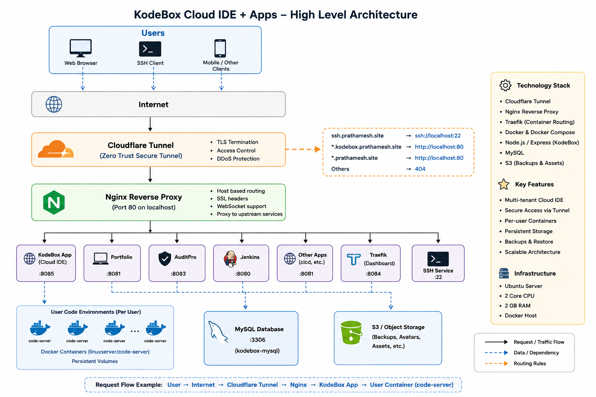

# Self-Hosted-Server


### Self-Assembled & Production-Inspired Home Server Infrastructure

> A self-hosted Ubuntu server built from repurposed PC hardware and configured as a production-inspired homelab. This project demonstrates end-to-end infrastructure engineering—from hardware assembly and Linux administration to Docker containerization, reverse proxy configuration, secure networking, and hosting multiple self-managed applications.

---
## Architecture


#  Overview

**Self-Hosted-Server** is my personal homelab built to gain hands-on experience with infrastructure engineering, Linux system administration, networking, containerization, and self-hosting.

Instead of relying solely on cloud providers, I assembled and configured my own server using repurposed PC hardware and transformed it into a centralized platform capable of hosting multiple applications securely under different subdomains.

The server acts as a personal cloud environment where I experiment with production-grade technologies including Docker, Nginx, Cloudflare Tunnel, Traefik, Jenkins, and MySQL while learning how modern backend infrastructure is designed, deployed, secured, and maintained.

This project bridges both **hardware engineering** and **software infrastructure**, providing practical exposure to the complete lifecycle of building and operating a self-hosted server.

---

#  High Level Architecture

```text
                           Internet Users
                                  │
                                  ▼
                           Cloudflare DNS
                                  │
                                  ▼
                    Cloudflare Tunnel (HTTPS)
                                  │
                                  ▼
                    Ubuntu Self Hosted Server
                                  │
                                  ▼
                       Nginx Reverse Proxy
                                  │
         ┌───────────────┬───────────────┬───────────────┬───────────┬ 
         ▼               ▼               ▼               ▼           ▼
    Portfolio       Jenkins        AuditPro        Traefik        Kodebox
                                                   
```

---

#  Features

##  Hardware Assembly

* Built a fully functional server using repurposed PC hardware
* Upgraded RAM for improved multitasking
* Installed SSD for faster system performance
* Improved cooling for stable 24×7 operation
* Replaced SMPS for better power efficiency and reliability
* Optimized hardware for continuous server workloads

---

##  Linux Server Administration

* Ubuntu Server installation and configuration
* XFCE Desktop for initial server management
* User and permission management
* Service management using systemd
* SSH-based remote administration
* System monitoring and maintenance

---

##  Containerization

* Docker
* Docker Compose
* Persistent Docker Volumes
* Container Isolation
* Multi-container Application Hosting
* Easy Service Deployment

---

##  Reverse Proxy & Networking

* Nginx Reverse Proxy
* Host-based Routing
* WebSocket Support
* Reverse Proxy for Docker Containers
* Wildcard Domain Routing
* Internal Service Routing

---

##  Secure Remote Access

* Cloudflare Tunnel
* Cloudflare Zero Trust
* No Port Forwarding Required
* Automatic HTTPS
* Secure Public Access
* Wildcard Subdomain Support

---

##  Dynamic Routing

* Traefik Reverse Proxy
* Docker Service Discovery
* Automatic Container Routing
* Traefik Dashboard

---

##  Self Hosted Applications

* KodeBox Cloud IDE
* Portfolio Website
* Jenkins CI/CD
* AuditPro
* MySQL Database
* SSH Server
* Traefik Dashboard

---

##  Reliability & Security

* Automatic service restart after failures
* Recovery after power interruptions
* Recovery after network outages
* HTTPS Everywhere
* Private Internal Services
* Docker Network Isolation
* Secure Remote Administration

---


#  Tech Stack

### Hardware

* Custom Built PC
* SSD Storage
* Upgraded RAM
* Enhanced Cooling System
* Dedicated Power Supply (SMPS)

### Operating System

* Ubuntu Server
* XFCE Desktop

### Containerization

* Docker
* Docker Compose

### Reverse Proxy

* Nginx
* Traefik

### Networking

* Cloudflare Tunnel
* Cloudflare DNS
* SSH

### CI/CD

* Jenkins

### Database

* MySQL

### Self Hosted Applications

* KodeBox
* Portfolio
* AuditPro

---

#  Hosted Services

| Service           | Purpose                             |
| ----------------- | ----------------------------------- |
| Portfolio         | Personal Portfolio Website          |
| KodeBox           | Browser-Based Cloud IDE             |
| Jenkins           | Continuous Integration & Deployment |
| AuditPro          | Personal Project                    |
| MySQL             | Database Server                     |
| Traefik Dashboard | Reverse Proxy Dashboard             |
| SSH               | Secure Remote Administration        |

---

#  Request Flow

```text
Client Browser
        │
        ▼
Cloudflare DNS
        │
        ▼
Cloudflare Tunnel
        │
        ▼
Ubuntu Server
        │
        ▼
Nginx Reverse Proxy
        │
        ▼
Requested Application
        │
        ▼
Docker Container
```

---

#  Repository Structure

```text
Self-Hosted-Server/

├── cloudflared/
│   └── config.yml
│
├── nginx/
│   ├── sites-available/
│   └── sites-enabled/
│
├── docker/
│   ├── traefik/
│   ├── mysql/
│   ├── kodebox/
│   ├── jenkins/
│   └── docker-compose.yml
│
├── scripts/
│
├── docs/
│
└── README.md
```

---

#  Getting Started

### 1. Assemble the Hardware

* Install SSD
* Upgrade RAM
* Configure Cooling
* Install Reliable SMPS

### 2. Install Ubuntu Server

* Install Ubuntu Server
* Configure networking
* Enable SSH
* Install XFCE (optional)

### 3. Install Required Software

* Docker
* Docker Compose
* Nginx
* Cloudflare Tunnel
* Traefik
* Jenkins
* MySQL

### 4. Deploy Applications

Containerize and deploy applications using Docker Compose.

### 5. Configure Cloudflare Tunnel

Expose applications securely without opening router ports.

---

#  Running Services

* Cloudflare Tunnel
* Nginx
* Docker Engine
* Traefik
* KodeBox
* Jenkins
* Portfolio
* AuditPro
* MySQL

---

#  Infrastructure Highlights

* Self-Assembled Server Hardware
* Ubuntu-Based Infrastructure
* Docker Containerized Applications
* Reverse Proxy Architecture
* Wildcard DNS Routing
* Cloudflare Zero Trust
* Automatic HTTPS
* Persistent Docker Volumes
* Secure SSH Access
* Multiple Self-Hosted Applications
* Production-Inspired Infrastructure
* High Service Availability

---

#  Learning Outcomes

This project helped me gain practical experience with:

* Computer Hardware Assembly
* Linux System Administration
* Docker & Docker Compose
* Reverse Proxy Configuration
* Cloudflare Tunnel
* DNS & Networking
* SSH Administration
* HTTPS & SSL
* Jenkins CI/CD
* Container Networking
* Docker Volume Management
* Infrastructure Design
* Self Hosting
* Production Deployment Concepts
* Service Recovery & Reliability
* Server Performance Optimization

---

#  Future Improvements

* Kubernetes Cluster
* Docker Swarm
* Prometheus Monitoring
* Grafana Dashboards
* Loki Logging
* Redis Cache
* Automated Backup Strategy
* VPN Gateway
* Harbor Registry
* Terraform
* Ansible
* GitOps Deployment
* Multi-node Homelab Cluster

---

#  Screenshots

* Hardware Setup
* Server Architecture
* Docker Containers
* Nginx Configuration
* Cloudflare Dashboard
* Traefik Dashboard
* Jenkins
* Hosted Applications


#  Why this project?

Most developers interact only with cloud platforms, where the underlying infrastructure is abstracted away. I built this project to understand the complete stack—from assembling the physical server to deploying and managing production-inspired services.

By building the hardware, installing and configuring the operating system, setting up networking, securing remote access, containerizing applications, and managing multiple services, I gained practical experience across infrastructure engineering, Linux administration, DevOps, networking, and self-hosting.

This project demonstrates the ability to design, build, deploy, secure, and maintain a complete self-hosted infrastructure, showcasing skills directly relevant to Backend, DevOps, Cloud, Site Reliability Engineering (SRE), and Infrastructure Engineering roles.
